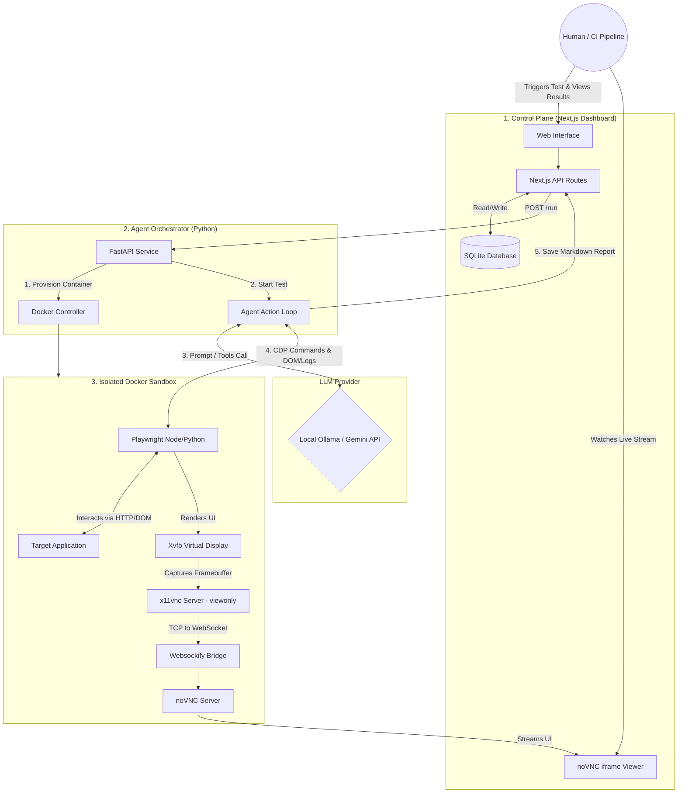

# System Design: Autonomous App Testing Agent

This document provides a visual and structural breakdown of the App Testing Agent system. It illustrates how the decoupled layers—Dashboard, Orchestrator, Sandbox, and LLM—communicate to execute autonomous tests while providing a view-only stream to the user.

## 1. System Architecture Diagram

The following diagram uses Mermaid.js. Most modern markdown viewers and repository hosts (like GitHub) render it when the diagram is in a fenced code block with the `mermaid` language tag.

## 2. Component Explanations

### 2.1. The Control Plane (Next.js)

This is the user-facing entry point and the persistence layer.

Web Interface / API Routes: Receives manual clicks from developers or automated webhook payloads from a CI/CD pipeline (e.g., GitHub Actions).

SQLite Database: Stores the test definitions (the "instructions" for the agent), tracks the status of the run (Pending, Running, Success, Failed), and stores the final Markdown report.

noVNC iframe Viewer: A dedicated UI component that renders a websocket stream, allowing the user to watch the browser actions live without interfering.

### 2.2. The Agent Orchestrator (Python / FastAPI)

This is the central nervous system of the app. It translates high-level intents into low-level sandbox execution.

FastAPI Service: Acts as the listener for the Control Plane.

Docker Controller: Uses the Docker SDK to dynamically spin up the Execution_Sandbox container, mount necessary code, and tear it down upon completion.

Agent Action Loop (Think-Act-Observe): The core intelligence engine. It formats prompts, sends the current DOM/Network state to the LLM, parses the LLM's requested tool actions (e.g., click_element), and routes those commands into the Sandbox.

### 2.3. The Execution Sandbox (Docker)

A fully isolated, ephemeral environment.

Target Application: The app being tested, running locally inside the container (e.g., localhost:3000).

Playwright: The browser automation tool. It interacts with the Target App and intercepts backend network calls (XHR/Fetch) and console logs.

The Streaming Stack (Xvfb -> x11vnc -> Websockify): Because Docker is headless, Playwright renders into Xvfb (a fake monitor). x11vnc captures this fake monitor in -viewonly mode. websockify translates the VNC data into a web-friendly socket, which is then piped directly to the Dashboard.

### 2.4. The LLM Provider

Ollama or Cloud APIs: Acts strictly as a functional reasoning engine. It maintains no state. The Orchestrator feeds it context (The objective + The DOM + Previous actions), and the LLM responds with a structured function call representing its next move.

## 3. The Step-by-Step Data Flow

Here is how data moves through the system during a single test run:
- Initialization: The User or CI pipeline hits the Next.js Dashboard. The Dashboard creates a database record and sends the Test Case JSON to the Python Orchestrator.

- Provisioning: The Orchestrator spins up the Docker Sandbox. Inside, the Target Application boots up, and the Xvfb/noVNC stack starts listening on port 6080.

- Stream Connection: The Orchestrator replies to the Dashboard that the container is ready. The Dashboard's iframe connects to ws://localhost:6080 to start showing the live video feed.

- The Loop:

    - Observe: Playwright grabs the HTML DOM and any pending network logs. The Orchestrator sends these to the LLM.

    - Think: The LLM evaluates the DOM against the test goal.

    - Act: The LLM returns a JSON payload asking to click a specific CSS selector.

    - Execute: The Orchestrator maps this to a Playwright page.click() command.

- Reporting: Once the objective is met (or fails), the Orchestrator sends all network logs and the final screenshot to the LLM for a root-cause analysis.

- Teardown: The generated Markdown report is POSTed back to the Next.js API, saved to SQLite, and the Docker Sandbox is forcefully killed and removed.